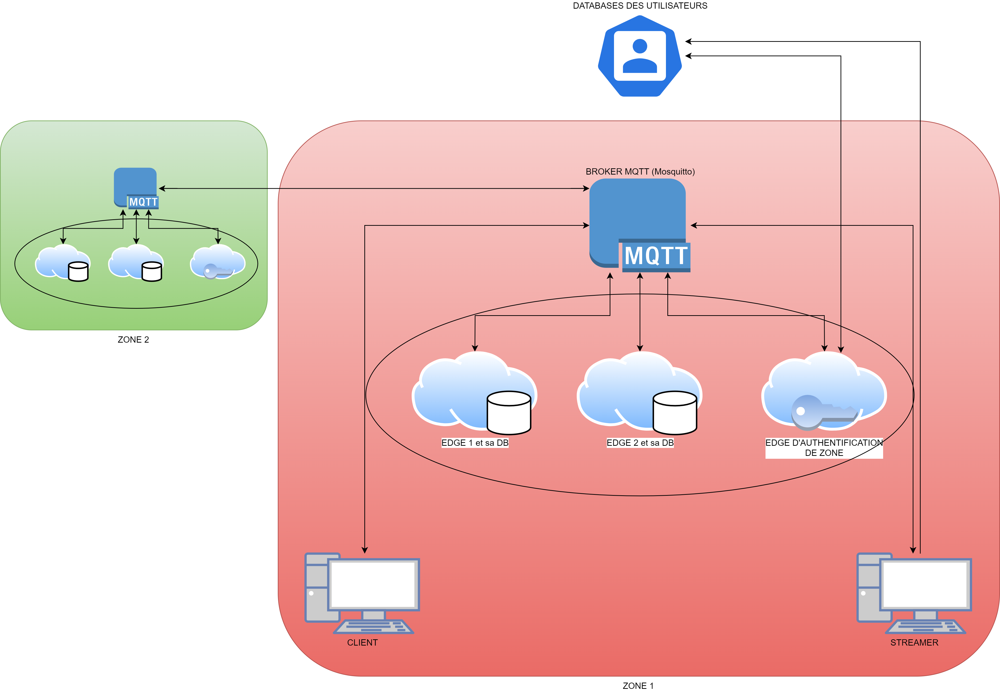

# 🎬 TW'INSA - Plateforme de Streaming Décentralisée

> Projet académique - INSA 5A ICY - Sécurité du Cloud

TW'INSA est une plateforme de streaming vidéo réalisée dans le cadre d'un projet académique à l'INSA, axée sur la sécurité du cloud. Le système combine une architecture distribuée avec des mécanismes cryptographiques pour offrir une expérience de streaming sécurisée.


---

## 📋 Table des matières

- [Vue d'ensemble](#-vue-densemble)
- [Équipe de développement](#-équipe-de-développement)
- [Architecture du système](#-architecture-du-système)
- [Composants](#-composants)
- [Installation](#-installation-rapide)
- [Utilisation](#-utilisation)
- [Technologies](#-technologies)
- [Documentation détaillée](#-documentation-détaillée)

---

## 🌟 Vue d'ensemble

Une plateforme de streaming vidéo en temps réel avec architecture distribuée, utilisant des signatures cryptographiques pour garantir l'intégrité des contenus, des edge clusters pour la distribution optimale, et une interface moderne inspirée de Pinterest.

### Fonctionnalités principales

- **Streaming en direct (Live)** avec vérification cryptographique en temps réel
- **Vidéos à la demande (VOD)** stockées de manière distribuée
- **Authentification sécurisée** via Supabase
- **Sélection automatique** du meilleur edge selon la latence

---

## 👥 Équipe de développement

- **Abla BEKKALI** - Interface utilisateur
- **Romain GAILLARD** - Interface utilisateur
- **Corentin PHILLIPE** - Edge clusters & Architecture
- **Thomas MENU** - Edge clusters & Architecture
- **Elouan SAGNARD** - Edge clusters & Architecture
- **Tristan DUCRAUX** - Edge clusters & Architecture
- **Alban DELUCHE** - Edge clusters & Architecture
- **Baptiste SALTEL** - Edge clusters & Architecture
- **Maxime LEMAITRE** - Système de signature cryptographique (SIS)
- **Clément OGÉ** - Système de signature cryptographique (SIS)

---

## Architecture du système



## 🧩 Composants

Le projet est divisé en 4 composants principaux :

### 1. 📱 [User Interface](./user-interface/README.md)

**Technologies** : Flutter, Dart  
**Responsabilités** :

- Interface utilisateur moderne et responsive
- Authentification des utilisateurs (Supabase)
- Communication MQTT avec les edges
- Sélection automatique du meilleur edge
- Lecture de streams live et VOD
- Signature et vérification de chunks (via JAR)

**Fonctionnalités clés** :

- Interface avec grille de vidéos
- Streaming live avec capture caméra (1 FPS)
- Playback vidéo avec reconstruction de chunks

### 2. ⚡ [Edge Cluster](./edge-cluster/README.md)

**Technologies** : Python 3.13, SQLite, Java 21  
**Responsabilités** :

- Stockage distribué des vidéos et métadonnées
- Distribution de contenu aux clients
- Vérification d'intégrité des chunks signés
- Synchronisation automatique entre edges

**Composants** :

- `main.py` : Serveur edge principal (stockage, streaming, sync)
- `auth_edge.py` : Serveur d'authentification (1 par zone)
- `lib/db.py` : Gestion base de données SQLite
- `lib/status.py` : Métriques système (CPU, RAM, disque)

### 3. 🔐 [SIS (Signature System)](./SIS/README.md)

**Technologies** : Java 17, Maven, JPBC (courbes elliptiques)  
**Responsabilités** :

- Génération de signatures cryptographiques
- Vérification d'intégrité des données
- Délégation de clés pour les edges
- Génération d'identifiants uniques

**Entités** :

- **Owner** (Streamer) : Signe les données, délègue des clés aux edges
- **Fog** (Edge) : Vérifie et re-signe les chunks avec clés déléguées
- **Client** (Viewer) : Vérifie les signatures et fusionne les chunks

**Opérations disponibles** :

```bash
# Signature par le propriétaire
owner sign <fichier> <data_id>

# Vérification par le fog
fog verify <signature>

# Fusion par le client
client merge <fichier_signature>

# Génération d'identité
identification <identity>
```

### 4. 🌐 Broker MQTT

**Technologies** : Eclipse Mosquitto  
**Configuration** :

- Port : 1883
- Authentification : Anonyme (pour le développement)
- Topics principaux : Voir le README de l'**[Edge Cluster](./edge-cluster/README.md)**

---

## 🚀 Installation

### Prérequis

- **Docker & Docker Compose** (recommandé)
- **Java 21** (OpenJDK)
- **Flutter SDK 3.35.6+** (pour l'interface)
- **Maven** (pour compiler SIS)
- **Compte Supabase** (gratuit)

### Méthode 1 : Docker Compose (recommandé)

1. **Cloner le projet**

```bash
git clone https://github.com/maxlem24/cloud-streaming.git
cd cloud-streaming
```

2. **Configurer les variables d'environnement**

```bash
# Créer edge-cluster/.env
cd edge-cluster
cat > .env << EOF
MQTT_BROKER=localhost
SUPABASE_URL=https://votre-projet.supabase.co
SUPABASE_KEY=votre_cle_anon_key
EOF
cd ..
```

3. **Compiler le JAR de signature**

```bash
cd SIS
mvn clean package
# Copier le JAR dans edge-cluster
cp target/cloud_signature-1.0-SNAPSHOT-jar-with-dependencies.jar ../edge-cluster/
cd ..
```

4. **Lancer l'infrastructure**

```bash
docker-compose up -d
```

Cela démarre :

- ✅ Broker MQTT (port 1883)
- ✅ Edge d'authentification
- ✅ Edge cluster principal

5. **Lancer l'interface Flutter**

```bash
cd user-interface
flutter pub get
flutter run
```

### Méthode 2 : Installation manuelle

Consulter les README individuels de chaque composant :

- [Edge Cluster](./edge-cluster/README.md#-installation)
- [SIS](./SIS/README.md#compilation)
- [User Interface](./user-interface/README.md#-lancement)

---

## 📖 Utilisation

### 1. Créer un compte

Au premier lancement de l'application Flutter :

1. Cliquer sur "S'inscrire"
2. Entrer email, username et mot de passe
3. Valider l'email (selon configuration Supabase)

### 2. Explorer les vidéos

- La page d'accueil affiche les vidéos disponibles en grille
- Les lives actifs sont identifiés par un badge rouge
- Cliquer sur une vidéo pour la regarder

### 3. Lancer un live

1. Cliquer sur le bouton "Go Live"
2. Autoriser l'accès à la caméra
3. Le stream démarre automatiquement (1 FPS)
4. Les chunks sont signés puis envoyés aux edges
5. Les spectateurs peuvent rejoindre via la liste des lives

### 4. Regarder un stream

Pas besoin d'authentification pour regarder un stream.
Les chunks sont reçus en temps réel et affichés dès reconstruction

---

## 🛠️ Technologies

### Backend & Infrastructure

| Technologie           | Usage                  | Version                |
| --------------------- | ---------------------- | ---------------------- |
| **Python**            | Edge clusters          | 3.13+                  |
| **Java**              | Système de signature   | 17 (JAR), 21 (runtime) |
| **SQLite**            | Base de données locale | 3.x                    |
| **Eclipse Mosquitto** | Broker MQTT            | Latest                 |
| **Docker**            | Conteneurisation       | 20.x+                  |

### Frontend

| Technologie | Usage        | Version |
| ----------- | ------------ | ------- |
| **Flutter** | Framework UI | 3.35.6+ |
| **Dart**    | Langage      | 3.9.2+  |

### Services externes

- **Supabase** - Authentification et base de données utilisateurs
- **MQTT Protocol** - Messagerie pub/sub temps réel

### Authentification

- **Utilisateurs** : JWT via Supabase (session tokens)
- **Edges** : UUID généré au démarrage + clés cryptographiques
- **Zones** : Serveur d'identification dédié (1 par zone)

### Intégrité des données

- ✅ Chaque chunk vidéo est signé cryptographiquement
- ✅ Les signatures sont vérifiées à chaque transfert
- ✅ Les chunks corrompus sont automatiquement rejetés
- ✅ Base64 encoding pour transport MQTT

---

## 📚 Documentation détaillée

Pour plus d'informations sur chaque composant :

- **[Edge Cluster](./edge-cluster/README.md)** - Architecture distribuée, topics MQTT, base de données
- **[SIS (Signature)](./SIS/README.md)** - Algorithmes cryptographiques, commandes, limitations
- **[User Interface](./user-interface/README.md)** - Interface Flutter, services MQTT, workflows

---

## 🔮 Améliorations futures

- [ ] Implémentation complète des signatures déléguées
- [ ] Support multi-zones via le bridge Mosquitto
- [ ] Encodage vidéo adaptatif (multi-bitrate)
- [ ] Système de VOD
